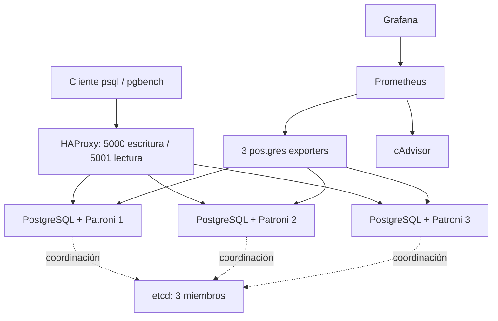

# Laboratorio PostgreSQL con Patroni y Docker

Proyecto de Gonzalo para practicar infraestructura, replicación y recuperación ante la caída de un nodo PostgreSQL. Incluye Docker Compose, Patroni, etcd, HAProxy y monitoreo con Prometheus y Grafana.

**Para evaluar el proyecto:** revisar la arquitectura, los [resultados de carga](docs/RESULTADOS.md) y el [guion de demo](docs/PRESENTACION.md). Las configuraciones están en `config/` y `monitoring/`. El laboratorio contiene 14 servicios.

También están disponibles el [recorrido de evaluación](docs/EVALUACION.md) y las [validaciones realizadas](docs/VALIDACION.md).

## Arquitectura



Las flechas de monitoreo representan consultas de métricas. PostgreSQL replica los datos entre el primario y sus réplicas. Patroni administra el rol de cada nodo utilizando etcd como almacenamiento de coordinación. HAProxy consulta `/primary` y `/replica` en la API de Patroni para elegir el destino de nuevas conexiones.

## Qué demuestra

- Configuración reproducible de tres nodos PostgreSQL y tres miembros etcd con volúmenes separados.
- Endpoint de escritura y endpoint de lectura a través de HAProxy.
- Recolección de métricas de PostgreSQL y contenedores.
- Quince corridas históricas de pgbench, con 10, 25, 50, 100 y 200 clientes.
- Script explícito de creación de usuarios administrativos, de aplicación y de monitoreo.
- Workflow de CI que valida configuraciones y construye la imagen de Patroni. Su ejecución se consulta en la pestaña **Actions**.

El historial del TP incluye replicación, pruebas de permisos y migración a Debian. Los archivos de carga publicados son evidencia histórica. La preparación de este repositorio no volvió a ejecutar failover ni benchmarks. CI valida configuración y construcción, no despliega el proyecto ni prueba alta disponibilidad de extremo a extremo.

## Inicio rápido

Requisitos: Git y Docker Engine con Compose v2, o Docker Desktop con contenedores Linux. cAdvisor usa montajes del host Linux y modo privilegiado. Su visibilidad en Docker Desktop puede diferir de un host Linux nativo.

```sh
git clone https://github.com/GonzaloAPU/dockerLaboratorioCluster-db.git
cd dockerLaboratorioCluster-db
```

Copiar `.env.example` a `.env` (`cp .env.example .env` en Linux o `Copy-Item .env.example .env` en PowerShell). Reemplazar todas las contraseñas. Los nombres de usuarios del ejemplo coinciden con el SQL y con `pg_hba`; conservarlos durante la primera instalación.

```sh
docker compose config --quiet
docker compose up -d --build
docker compose exec db-node1 patronictl -c /etc/patroni/patroni.yml list
```

Esperar a que aparezcan un líder y dos réplicas en estado `streaming`. `depends_on` ordena el inicio, pero no garantiza que la base esté lista.

### Usuarios y base de aplicación

En una instalación nueva, ejecutar una sola vez, cuando el clúster esté listo:

```sh
docker compose exec client psql -h haproxy -p 5000 -U postgres -d postgres -v ON_ERROR_STOP=1 -f /scripts/01-users.sql
```

El SQL lee las contraseñas del entorno del cliente, crea `cluster_admin`, `app_user`, `monitor_user` y la base `clusterdb`. No es idempotente: si esos objetos ya existen, detenerse y revisar el estado antes de repetirlo. Las bases persistentes conservan sus usuarios y contraseñas aunque se edite `.env`.

Los exporters pueden mostrar errores hasta crear `monitor_user`. Después de la inicialización:

```sh
docker compose restart postgres-exporter-node1 postgres-exporter-node2 postgres-exporter-node3
docker compose ps
```

### Verificación del enrutamiento

```sh
docker compose exec client psql -h haproxy -p 5000 -U postgres -d postgres -c "SELECT inet_server_addr(), pg_is_in_recovery();"
docker compose exec client psql -h haproxy -p 5001 -U postgres -d postgres -c "SELECT inet_server_addr(), pg_is_in_recovery();"
```

Se espera `false` en escritura y `true` en lectura. Si se cambió el superusuario del ejemplo, adaptar `-U`.

## Monitoreo

| Servicio | Acceso local |
| --- | --- |
| Grafana | http://localhost:3001 |
| Prometheus | http://localhost:9090 |
| HAProxy, estadísticas | http://localhost:7000 |
| cAdvisor | http://localhost:8080 |

En Grafana, ingresar con `admin` y la contraseña configurada en `.env`. Agregar una fuente Prometheus con URL `http://prometheus:9090`. Esta copia no incluye dashboards provisionados: crear paneles con `pg_up`, `pg_stat_database_numbackends` y `rate(pg_stat_database_xact_commit[5m])` si esas métricas están disponibles. Revisar primero los targets en Prometheus. Las reglas de alerta y la entrega de notificaciones siguen pendientes.

## Seguridad y alcance

Los puertos publicados se vinculan a `127.0.0.1` para la evaluación local. PostgreSQL, etcd y los exporters permanecen en la red de Compose. `.env`, backups y directorios de datos no se versionan. `.env.example` contiene únicamente marcadores.

Este es un laboratorio en un único host. Una caída del host afecta a todos los servicios y existe una sola instancia de HAProxy. La configuración no habilita replicación síncrona ni TLS entre componentes. No promete pérdida de datos cero. Los volúmenes conservan datos, pero no sustituyen backups y restauraciones verificadas. La imagen instala Patroni sin fijar su versión exacta, por lo que futuras reconstrucciones pueden variar.

El cliente tiene credenciales administrativas para operar el laboratorio. Una aplicación debe usar `app_user`. El script configura permisos de aplicación para tablas y secuencias creadas por `cluster_admin` en `public`; los objetos creados por otros propietarios requieren permisos explícitos.

## Demo y próximos pasos

El [guion de seis minutos](docs/PRESENTACION.md) incluye consultas, un ensayo controlado de caída del líder y preguntas técnicas. Ensayar sobre datos descartables y recuperar el nodo detenido al finalizar.

Prioridades siguientes: probar alertas con activación y recuperación, provisionar dashboards, fijar dependencias, automatizar pruebas de failover y documentar restauraciones. Un despliegue distribuido necesita resolver también disponibilidad del proxy y seguridad de comunicaciones.

Para detener conservando volúmenes:

```sh
docker compose down
```

## Referencias

- [Patroni](https://patroni.readthedocs.io/)
- [PostgreSQL y pgbench](https://www.postgresql.org/docs/17/pgbench.html)
- [Docker Compose](https://docs.docker.com/compose/)
- [Prometheus](https://prometheus.io/docs/introduction/overview/)
